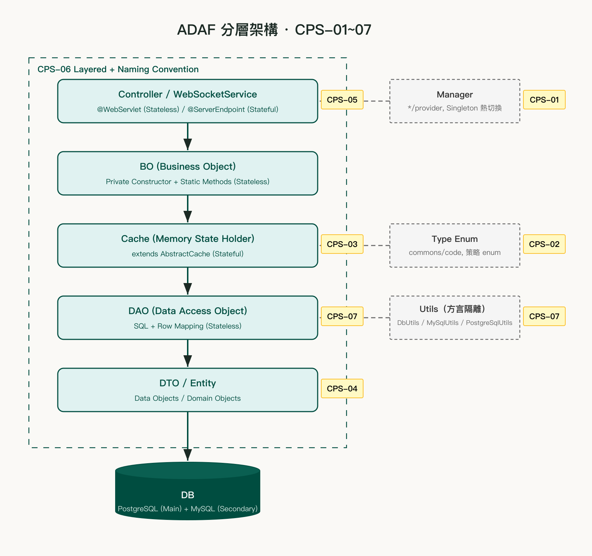
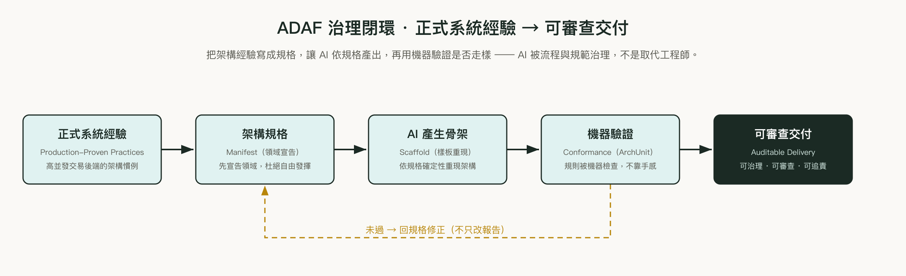

# ADAF — AI 架構生成框架

[](LICENSE)
[](#)
[](https://github.com/yao-beyond/myGamefi/actions/workflows/ci.yml)
[](https://github.com/yao-beyond/myGamefi/commits/main)
[](https://github.com/yao-beyond/myGamefi/stargazers)

🔗 **Repo**: https://github.com/yao-beyond/myGamefi

```bash
git clone https://github.com/yao-beyond/myGamefi.git
```

> **一句話**：把一套成熟後端的架構規則寫成「AI 看得懂、機器測得出」的規格——讓 AI 照著生成程式，再用測試擋住走樣。

**白話比喻**：它像給 AI 的一份「蓋房子的施工規範 + 標準圖 + 驗收清單」。你說要蓋什麼，AI 照圖施工，最後驗收測試自動檢查有沒有照規範蓋。

它**不是**一個你 `import` 的程式庫，而是一份**規格 + 樣板 + 測試**，餵給 AI（Claude / GPT）用。

---

## ⚡ 60 秒 Quickstart

先跑一次「綠燈範例」，親眼看到框架在運作：

```bash
git clone https://github.com/yao-beyond/myGamefi.git
cd myGamefi/examples/payout-service
mvn test
```

你會看到（全綠）：
```
Tests run: 15, Failures: 0
  ├─ 11 條架構合規測試（ArchUnit）通過 ← 架構沒走樣
  └─ 4 條行為測試通過               ← 功能正確
```

這就是 ADAF 的核心：**AI 生成的程式碼，能被測試自動驗收**。完整 5 分鐘上手見 **[QUICKSTART.md](QUICKSTART.md)**。

---

## 🧭 選一條路

| 你是… | 從這裡開始 |
|---|---|
| 👤 **想快速試用的開發者** | [QUICKSTART.md](QUICKSTART.md) → [`examples/payout-service/`](examples/payout-service/) |
| 📖 **想照著做一遍的人** | [USAGE.md](USAGE.md)（完整教學：從需求到一個功能） |
| 🤖 **要讓 AI 依框架生成程式** | [AI_CONTEXT.md](AI_CONTEXT.md)（貼進 AI context）+ [PROMPTS.md](PROMPTS.md)（可複製指令） |
| 🛡️ **只想加 CI 架構守門** | [`scaffold/conformance/`](scaffold/conformance/) |
| 🏛️ **想看完整規格 / 維護框架** | [ARCH_BLUEPRINT.md](ARCH_BLUEPRINT.md) |
| ❓ **名詞看不懂 / 有疑問** | [GLOSSARY.md](GLOSSARY.md)、[FAQ.md](FAQ.md) |
| 💬 **想討論 / 提問 / 打招呼** | [Discussions 歡迎貼文](https://github.com/yao-beyond/myGamefi/discussions/1) |

---

## 它怎麼運作：規格 → 樣板 → 測試

三件事，缺一不可：

| 階段 | 白話 | 正式名 | 落在哪 |
|---|---|---|---|
| 1️⃣ 規格 | AI 動手前先把需求寫成清單，不准亂猜 | **Manifest** | [`ARCH_BLUEPRINT.md`](ARCH_BLUEPRINT.md) 第 4 章 |
| 2️⃣ 樣板 | AI 照 8 份參考程式碼複製結構 | **Scaffold** | [`scaffold/`](scaffold/) |
| 3️⃣ 測試 | 機器檢查架構有沒有走樣，沒過就退回 | **Conformance** | [`scaffold/conformance/`](scaffold/conformance/) |

> 核心信條：自然語言只描述「意圖」；真正讓 AI 確定性重現的是 **規格 → 樣板 → 測試**。**風格不是品味，是規則。**

---

## 規範了哪些架構決策（8 個模式）

每個模式（**CPS** = 架構模式編號，CPS-01~08）重點不在名字，而在它擋掉哪個**會失控的問題**：

| CPS | 模式 | 解決什麼問題 |
|---|---|---|
| 01 | Provider 註冊表 + 單例 Manager | 換供應商時**不停機、不出半初始化狀態** |
| 02 | Domain Type Enum | 型別分支邏輯散落各處，**改一個漏一個** |
| 03 | AbstractCache + 時間戳增量更新 | 大量熱資料快取，**併發更新會不會錯亂** |
| 04 | 階層式 Entity 巢狀 | 樹狀資料，**父子層級會不會不一致** |
| 05 | 單執行緒 WebSocket 廣播 | 實時推送，**慢連線會不會拖垮全體、訊息會不會亂序** |
| 06 | 分層 + 命名契約 | 分層依賴**會不會回呼、命名會不會漂移** |
| 07 | DAO + 方言隔離 | 多資料庫，**方言差異會不會散落、會不會 SQL injection** |
| 08 | Bitmask 角色分區 | 單一 codebase 多角色部署，**會不會做白工或漏通知**（見[系統結構範例](system_design/system-structure.md)） |



---

## 驗證證據（不是「我說有照規範」）

```
$ mvn test -Dadaf.basePackage=com.example.app
OK (11 tests)
```
- **合規碼：** 11 條規則全通過。
- **故意寫違規碼**（BO 內 `new XxxProvider()`、Controller 直呼 DAO）→ 測試**擋下 2 failures**。

fail-closed，不是裝飾用的綠燈。細節見 [`scaffold/conformance/README.md`](scaffold/conformance/README.md)。

---

## Repo 構成

| 路徑 | 內容 | 給誰 |
|---|---|---|
| [`QUICKSTART.md`](QUICKSTART.md) | 5 分鐘上手 | 👤 新手 |
| [`USAGE.md`](USAGE.md) | 完整教學 + worked example | 👤 開發者 |
| [`AI_CONTEXT.md`](AI_CONTEXT.md) | 給 AI agent 的最小入口 | 🤖 AI |
| [`PROMPTS.md`](PROMPTS.md) | 可複製的 AI 指令 | 🤖 AI / 👤 |
| [`GLOSSARY.md`](GLOSSARY.md) ・ [`FAQ.md`](FAQ.md) | 術語白話表 / 常見問題 | 👤 所有人 |
| [`ARCH_BLUEPRINT.md`](ARCH_BLUEPRINT.md) | 完整架構規格（憲法） | 🤖 AI / 架構維護者 |
| [`scaffold/`](scaffold/) ・ [`scaffold/conformance/`](scaffold/conformance/) | 8 個樣板 / 11 條 ArchUnit 測試 | 🤖 / 👤 |
| [`examples/payout-service/`](examples/payout-service/) | 可 `mvn test` 的綠燈範例 | 👤 開發者 |
| [`system_design/`](system_design/) | 架構圖、[系統結構範例](system_design/system-structure.md) | 👤 |

> 範例領域用通用電商（Payment / Order / Product）示範，與任何特定產業無關——替換成你的領域即可。

---

## 為什麼這重要（給評估導入的人）

把 AI 接進開發流程，企業真正怕的不是「AI 不夠快」，而是 AI 生成的程式碼**沒人能保證符合架構規範**、**換人或換 AI 就走樣**、出事時**講不清誰沒守規矩**。

ADAF 把這三件事收進一條閉環——規範寫成規格、AI 依規格產出、機器驗證走樣、交付可審查的證據：



這是「**AI 被流程與規範治理**」，而不是「AI 取代工程師」。

---

## License

[MIT](LICENSE)。`LICENSE` 的 copyright holder 請改成你的實際發佈名義。

---

由 **曾敬堯・堯策 YAO/CE** 維護。堯策的定位是「先理順流程，再談 AI 落地」；ADAF 是這套方法可落地的技術佐證之一。
